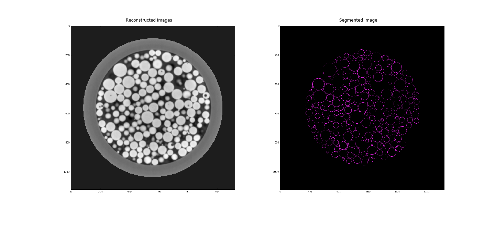
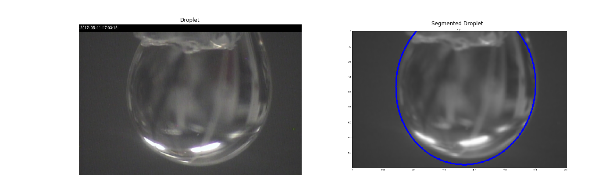

==========================================
X-Ray Image Segmentation Tools & Tutorials
==========================================

.. .. image:: source/img/ximage-logo.png
..    :width: 320px
..    :alt: ximage

The X-image is a collection of tools and tutorials for segmenting X-ray and RGB images using
image processing and compute vision techniques. 

Few examples
-------------

Detecting location and size of cells in X-ray images:

Detecting droplets using RGB camera images:

How to Contribute
-----------------

If you are working on a segmentation tool and would like to contribute

* Documentation: https://github.com/tomography/ximage/tree/master/doc
* Issue Tracker: https://github.com/tomography/ximage/docs/issues
* Source Code: https://github.com/tomography/ximage/ximage

.. toctree::
   :maxdepth: 1

   source/about
   source/install
   source/devguide
   source/api
   source/demo
   source/credits
