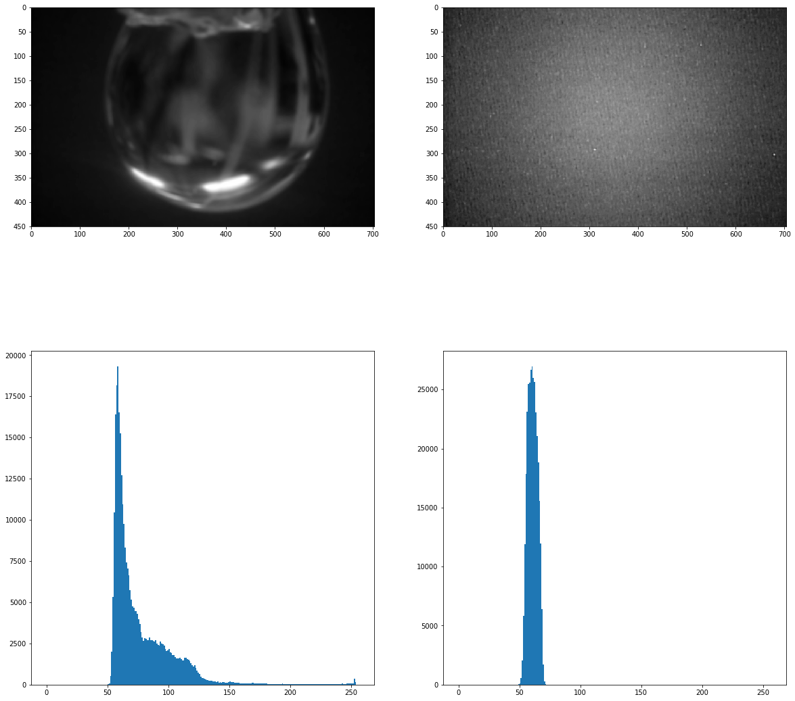
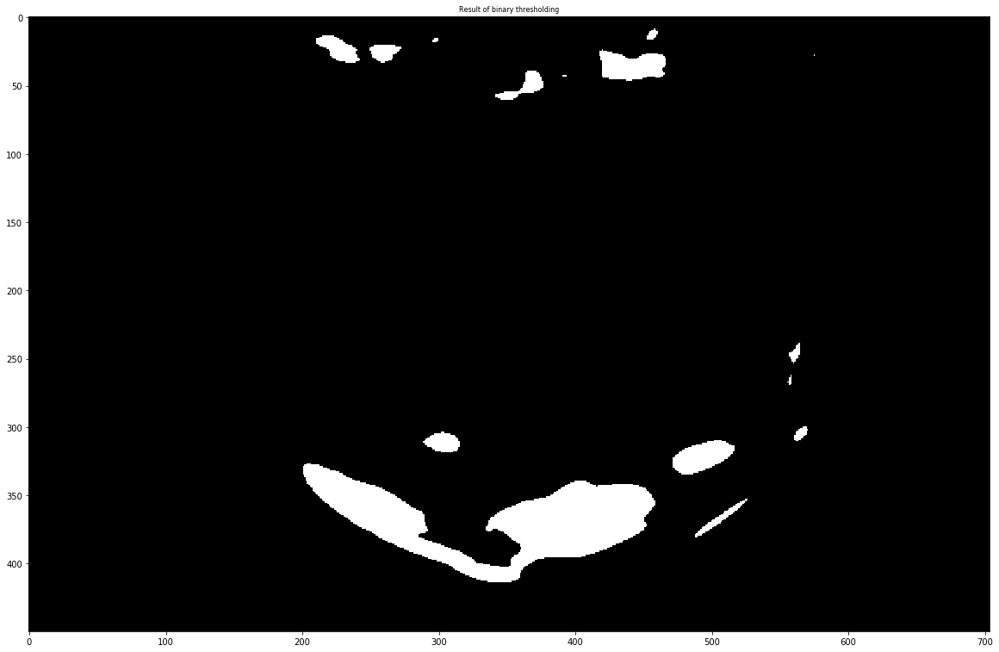
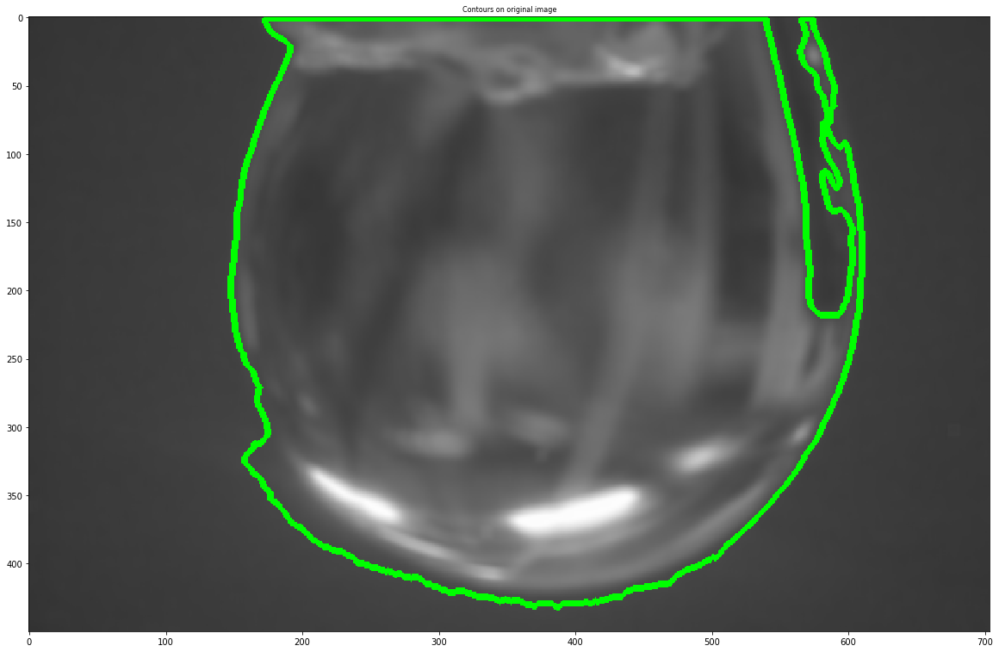
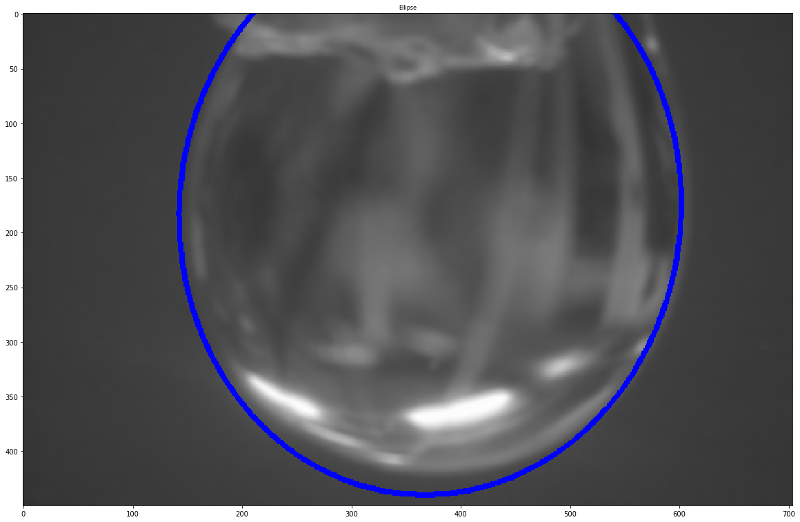

Droplet Detection
=================

You can download this eaxample as :download:`jupyter notebook<../../../docs/demo/Droplet_fitEllipse_1.ipynb>`

.. code:: python

    import numpy as np
    import matplotlib.pyplot as plt
    import matplotlib.image as mpimg
    import cv2
    import glob
    
    from ipywidgets import interact
    
    get_ipython().magic('matplotlib inline')
    plt.rcParams['figure.figsize'] = (20.0, 15.0) # set default size of plots
    plt.rcParams['image.interpolation'] = 'nearest'
    plt.rcParams['image.cmap'] = 'gray'
    plt.rcParams['axes.titlesize'] = 8
    
    %matplotlib inline
    

Detecting Background Pixels
~~~~~~~~~~~~~~~~~~~~~~~~~~~

.. code:: python

    bg = cv2.imread('./samples/bg_nolbl.jpg', 0) 
    droplet = cv2.imread('./samples/full_droplet_1.jpg', 0)
    
    # crop the top
    bg = bg[30:, :]
    droplet = droplet[30:, :]
    
    droplet = cv2.blur(droplet, ksize=(9,9))
    bg = cv2.blur(bg, ksize=(3,3))
    
    fig, ((ax1, ax2), (ax3, ax4)) = plt.subplots(2, 2, figsize=(20, 20))
    
    ax1.imshow(droplet)
    ax2.imshow(bg)
    ax3.hist(droplet.ravel(), 256, [0, 256])
    ax4.hist(bg.ravel(), 256, [0, 256])
    
    plt.show()

Apply thresholds
~~~~~~~~~~~~~~~~

.. code:: python

    low_thresh = 100
    high_thresh = 250
    
    def apply_thresh(low, high):
        ret, binary = cv2.threshold(droplet, low, high, 0)
        plt.figure(figsize=(20, 20))
        plt.imshow(binary, cmap='gray')
        plt.title('Result of binary thresholding')
        plt.show()
    
    interact(apply_thresh, low=(0,250), high=(0, 255));
    

Finding Contours
~~~~~~~~~~~~~~~~

.. code:: python

    low_thresh = 70
    high_thresh = 255
    
    ret, binary = cv2.threshold(droplet, low_thresh, high_thresh, 0)
    
    im2, contours, hierarchy = cv2.findContours(binary, cv2.RETR_EXTERNAL, cv2.CHAIN_APPROX_SIMPLE)
    segmented_img = np.dstack((droplet, droplet, droplet))
    cv2.drawContours(segmented_img, contours, -1, (0, 255, 0), 3)
    
    plt.figure(figsize=(20, 20))
    plt.title('Contours on original image')
    plt.imshow(segmented_img)
    plt.show()
    

Fitting an Ellipse
~~~~~~~~~~~~~~~~~~

.. code:: python

    final = np.dstack((droplet, droplet, droplet))
    
    for cnt in contours:
        if cnt.shape[0] > 5:
            an_ellipse = cv2.fitEllipse(cnt)
            cv2.ellipse(final, an_ellipse, (0, 0, 255), 3)
    
    plt.figure(figsize=(20, 20))
    plt.title('Ellipse')
    plt.imshow(final)
    plt.show()
    

