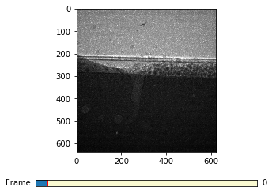
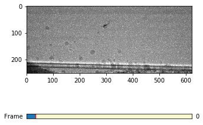

Particle Tracking
=================

This is an example of particle tracking in additive manufacturing high speed x-ray imaging.
You can download this eaxample as :download:`jupyter notebook<../../../docs/demo/particle_tracking.ipynb>`
or as :download:`python script<../../../docs/demo/particle_tracking.py>`

.. code:: python

    import matplotlib.pyplot as plt
    %matplotlib inline

.. code:: python

    import ximage
    import fnmatch
    import tomopy
    import numpy as np

.. code:: python

    top = '/local/dataraid/am/104_Ti_04_p90_S1/'

.. code:: python

    index_start = 1

.. code:: python

    # Total number of images to read
    nfile = len(fnmatch.filter(os.listdir(top), '*.tif'))
    print(nfile)

.. parsed-literal::

    361

.. code:: python

    rdata = ximage.load_raw(top, index_start)

.. code:: python

    ximage.slider(rdata[150:160:,:])

.. code:: python

    particle_bed_reference = ximage.particle_bed_location(rdata[0], plot=False)

.. code:: python

    print("Particle bed location: ", particle_bed_reference)

.. parsed-literal::

    ('Particle bed location: ', 253)

.. code:: python

    # Cut the images to remove the particle bed
    cdata = rdata[:, 0:particle_bed_reference, :]

.. code:: python

    ximage.slider(cdata[150:160:,:])

.. code:: python

    # Find the image when the shutter starts to close
    dark_index = ximage.shutter_off(rdata)
    print("Shutter CLOSED on image: ", dark_index)

.. parsed-literal::

    ('Shutter CLOSED on image: ', 344)

.. code:: python

    # Find the images when the laser is on
    laser_on_index = ximage.laser_on(rdata, particle_bed_reference, alpha=1.0)
    print("Laser ON on image: ", laser_on_index)

.. parsed-literal::

    ('Laser ON on image: ', 46)

.. code:: python

    # Set the [start, end] index of the blocked images, flat and dark.
    flat_range = [0, 1]
    data_range = [laser_on_index, dark_index]
    dark_range = [dark_index, nfile]
    
    flat = cdata[flat_range[0]:flat_range[1], :, :]
    proj = cdata[data_range[0]:data_range[1], :, :]
    dark = np.zeros((dark_range[1]-dark_range[0], proj.shape[1], proj.shape[2]))  

.. code:: python

    # Normalize the images
    ndata = tomopy.normalize(proj, flat, dark)
    ndata = tomopy.normalize_bg(ndata, air=ndata.shape[2]/2.5)
    ndata = tomopy.minus_log(ndata)

.. code:: python

    blur_radius = 3.0
    threshold = .04
    nddata = ximage.label(ndata, blur_radius, threshold)

.. parsed-literal::

    Image 0 contains 8 particles
    Image 1 contains 13 particles
    Image 2 contains 10 particles
    Image 3 contains 13 particles
    Image 4 contains 12 particles
    Image 5 contains 19 particles
    Image 6 contains 21 particles
    Image 7 contains 26 particles
    Image 8 contains 23 particles
    Image 9 contains 22 particles
    Image 10 contains 24 particles
    Image 11 contains 25 particles
    Image 12 contains 29 particles
    Image 13 contains 28 particles
    Image 14 contains 29 particles
    Image 15 contains 26 particles
    Image 16 contains 28 particles
    Image 17 contains 24 particles
    Image 18 contains 24 particles
    Image 19 contains 21 particles
    Image 20 contains 23 particles
    Image 21 contains 24 particles
    Image 22 contains 23 particles
    ....
    Image 295 contains 61 particles
    Image 296 contains 57 particles
    Image 297 contains 55 particles

