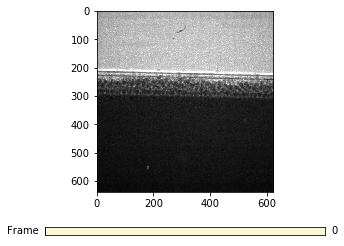
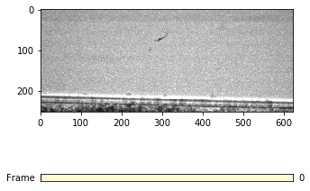

Particle Tracking
=================

This is an example of particle tracking in additive manufacturing high speed x-ray imaging.

.. code:: python

    import matplotlib.pyplot as plt
    %matplotlib inline

.. code:: python

    import ximage

.. code:: python

    top = '/local/dataraid/am/104_Ti_04_p90_S1/'

.. code:: python

    index_start = 1
    rdata = ximage.load_raw(top, index_start)
    ximage.slider(rdata)

.. code:: python

    particle_bed_reference = ximage.particle_bed_location(rdata[0], plot=False)
    print("Particle bed location: ", particle_bed_reference)
    ('Particle bed location: ', 253)

.. code:: python

    # Cut the images to remove the particle bed
    cdata = rdata[:, 0:particle_bed_reference, :]
    ximage.slider(cdata)

.. code:: python

    # Find the image when the shutter starts to close
    dark_index = ximage.shutter_off(rdata)
    print("Shutter CLOSED on image: ", dark_index)

.. parsed-literal::

    ('Shutter CLOSED on image: ', 344)

.. code:: python

    # Find the images when the laser is on
    laser_on_index = ximage.laser_on(rdata, particle_bed_reference, alpha=0.8)
    print("Laser ON on image: ", laser_on_index)

.. parsed-literal::

    ('Laser ON on image: ', 0)

