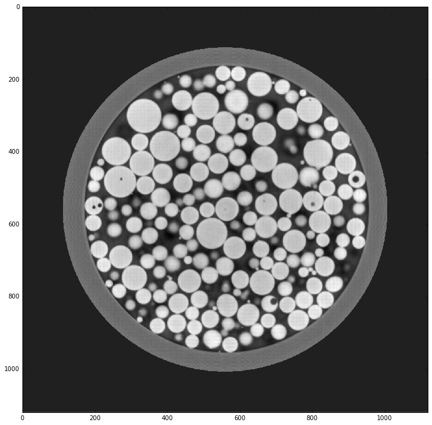
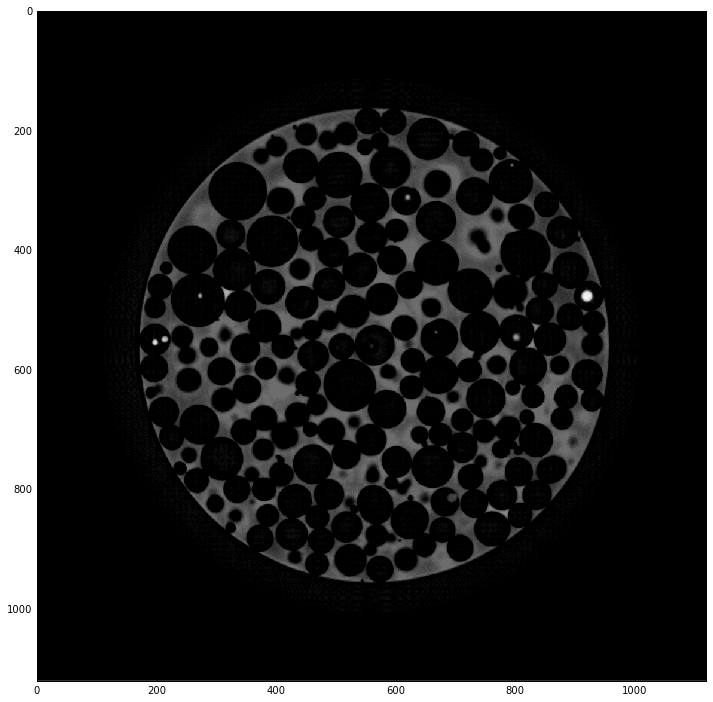

.. code:: python

    import matplotlib.pyplot as plt
    %matplotlib inline

.. parsed-literal::

    /local/dgursoy/Apps/anaconda3/lib/python3.5/site-packages/matplotlib/font_manager.py:273: UserWarning: Matplotlib is building the font cache using fc-list. This may take a moment.
      warnings.warn('Matplotlib is building the font cache using fc-list. This may take a moment.')
    /local/dgursoy/Apps/anaconda3/lib/python3.5/site-packages/matplotlib/font_manager.py:273: UserWarning: Matplotlib is building the font cache using fc-list. This may take a moment.
      warnings.warn('Matplotlib is building the font cache using fc-list. This may take a moment.')

Image reconstruction
====================

.. code:: python

    import tomopy
    import dxchange
    
    # Set path to the micro-CT data to reconstruct.
    fname = '/local/decarlo/sector1/g120f5/g120f5_'
    
    # Select the sinogram range to reconstruct.
    start = 100
    end = 116
    
    # Read the APS 1-ID raw data.
    proj, flat, dark = dxchange.read_aps_1id(fname, sino=(start, end))
    
    # Set data collection angles as equally spaced between 0-180 degrees.
    theta = tomopy.angles(proj.shape[0], ang1=0.0, ang2=360.0)
    
    # Flat-field correction of raw data.
    proj = tomopy.normalize(proj, flat, dark)
    
    # Ring removal.
    proj = tomopy.remove_stripe_sf(proj)
    
    # phase retrieval
    proj = tomopy.retrieve_phase(proj, alpha=1e-3, pad=True)
    
    # -log.
    proj = tomopy.minus_log(proj)
    
    # Reconstruct object using Gridrec algorithm.
    rec = tomopy.recon(proj, theta, center=576, algorithm='gridrec')
    
    # Mask each reconstructed slice with a circle.
    rec = tomopy.circ_mask(rec, axis=0, ratio=0.85)

.. code:: python

    plt.figure(figsize=(12, 12))
    plt.imshow(rec[8], cmap='gray', interpolation='none')

.. parsed-literal::

    <matplotlib.image.AxesImage at 0x7fecb2578ef0>

.. image:: sector1_files/sector1_3_1.png

Image sharpening
================

.. code:: python

    import cv2
    import numpy as np
    
    # Pick one slice for further processing.
    img = rec[8].copy()
    
    kernel = np.array([[-1,-1,-1], [-1,9,-1], [-1,-1,-1]])
    img = cv2.filter2D(img, -1, kernel)
    img = tomopy.circ_mask(np.expand_dims(img, 0), axis=0, ratio=0.8)[0]
    
    plt.figure(figsize=(12, 12))
    plt.imshow(img, cmap='gray', interpolation='none')

.. parsed-literal::

    <matplotlib.image.AxesImage at 0x7fec14e48048>

Artifact detection
==================

.. code:: python

    from skimage.morphology import reconstruction
    
    img0 = (255 * (img - img.min()) / (img - img.min()).max()).astype('uint8')
    mask = img0
    seed1 = np.copy(img0)
    seed2 = np.copy(img0)
    seed1[1:-1, 1:-1] = img0.max()
    seed2[1:-1, 1:-1] = img0.min()
    eris = reconstruction(seed1, mask, method='erosion')
    dila = reconstruction(seed2, mask, method='dilation')
    img0 = (eris+dila-img0)
    # img0 = img0 > 120
    
    plt.figure(figsize=(12, 12))
    plt.imshow(img0, cmap='gray', interpolation='none')

.. parsed-literal::

    <matplotlib.image.AxesImage at 0x7fec141e9a20>

Circle detection
================

.. code:: python

    from skimage import color
    from skimage.transform import hough_circle, hough_circle_peaks
    from skimage.feature import canny
    from skimage.draw import circle_perimeter
    
    img0 = (255 * (img - img.min()) / (img - img.min()).max()).astype('uint8')
    edges = canny(img0, sigma=2)
    hough_radii = np.arange(5, 50, 1)
    hough_res = hough_circle(edges, hough_radii)
    accums, cx, cy, radii = hough_circle_peaks(hough_res, hough_radii, total_num_peaks=300)
    
    img1 = np.zeros(img0.shape)
    img1 = color.gray2rgb(img1)
    for center_y, center_x, radius in zip(cy, cx, radii):
        circy, circx = circle_perimeter(center_y, center_x, radius)
        img1[circy, circx] = (20, 220, 20)
    
    plt.figure(figsize=(12, 12))
    plt.imshow(img1)

.. parsed-literal::

    <matplotlib.image.AxesImage at 0x7fec13d65908>

.. image:: sector1_files/sector1_9_1.png

